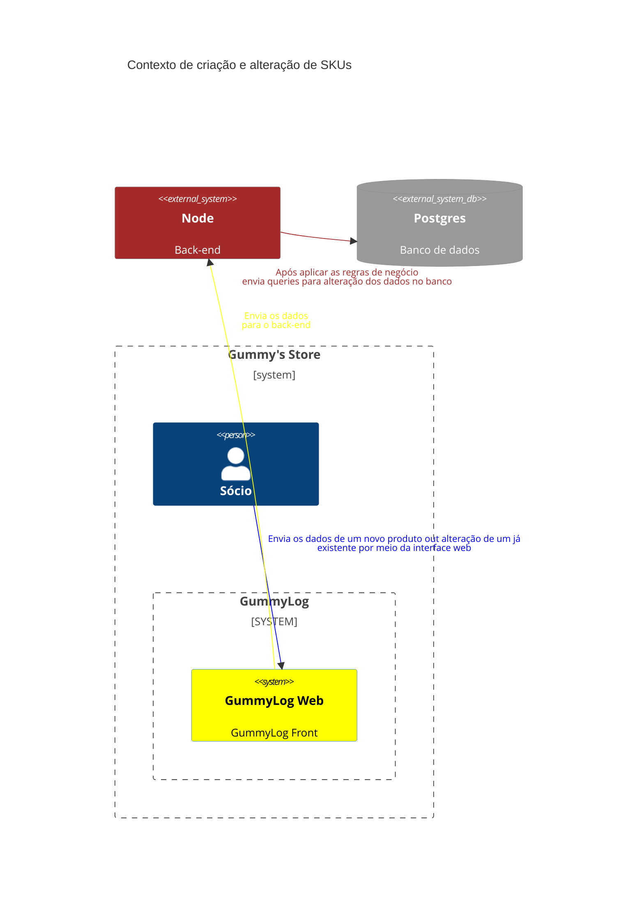
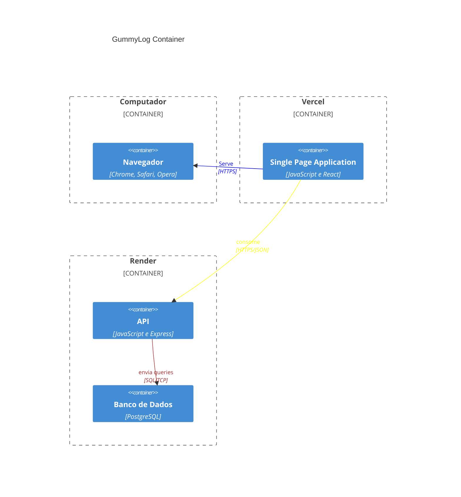
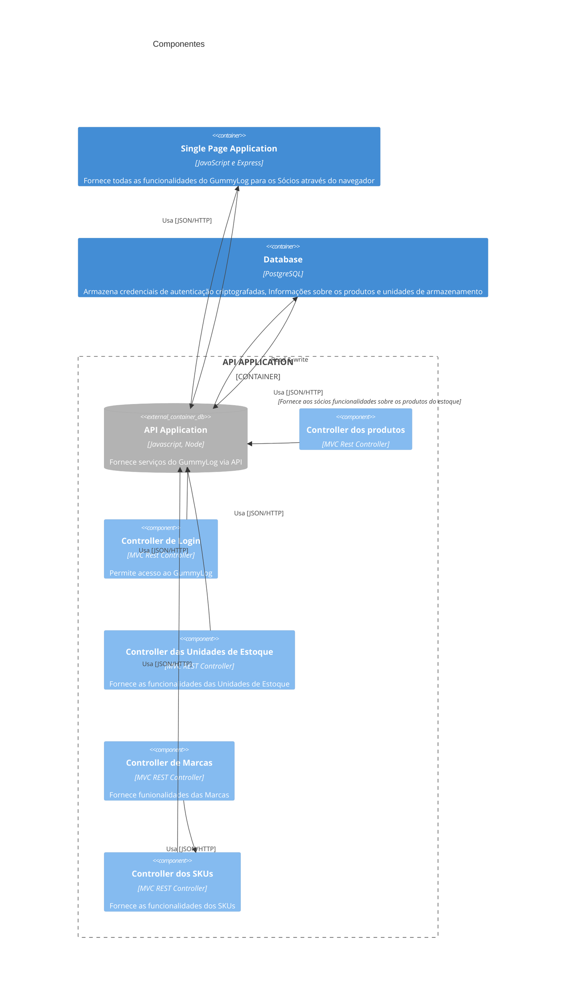

# C4 Model

## Contexto

```mermaid
C4Context
    title Contexto de criação e alteração de SKUs

    Boundary(GS, "Gummy's Store") {
        Person(partnerA, "Sócio")

        System_Boundary(GL, "GummyLog") {
            System(GLS, "GummyLog Web", "GummyLog Front", $bgColor="yellow", $fontColor="black")
        }
    }
    System_Ext(back, "Node", "Back-end", $bgColor="brown")
    SystemDb_Ext(db, "Postgres", "Banco de dados")

Rel(partnerA, GLS, "Envia os dados de um novo produto out alteração de um já <br> existente por meio da interface web")
UpdateRelStyle(partnerA, GLS, $lineColor="blue", $textColor="blue", $offsetY="-60")
Rel(GLS, back, "Envia os dados <br> para o back-end")
UpdateRelStyle(GLS, back, $lineColor="yellow",$textColor="yellow", $offsetY="-190")
Rel(back, db, "Após aplicar as regras de negócio <br> envia queries para alteração dos dados no banco")
UpdateRelStyle(back, db, $lineColor="brown", $textColor="brown", $offsetY="50", $offsetX="-100")

```

## Container

```mermaid
C4Container

title GummyLog Container

Container_Boundary(f3, "Computador") {
    Container(f4, "Navegador", "Chrome, Safari, Opera")
}

Container_Boundary(f1, "Vercel") {
    Container(spa, "Single Page Application", "JavaScript e React")
}
Container_Boundary(f2, "Render") {
    Container(back, "API", "JavaScript e Express")
    Container(db, "Banco de Dados", "PostgreSQL")
}

Rel(spa, f4, "Serve", "HTTPS")
UpdateRelStyle(spa, f4, $lineColor="blue", $textColor="blue", $offsetX="-20", $offsetY="-10")

Rel(spa, back, "consome", "HTTPS/JSON")
UpdateRelStyle(spa, back, $lineColor="yellow", $textColor="yellow")

Rel(back, db, "envia queries", "SQL/TCP")
UpdateRelStyle(back, db, $lineColor="brown", $textColor="brown", $offsetX="-35", $offsetY="20")
```

```mermaid
C4Component
title Componentes

Container(spa, "Single Page Application", "JavaScript e Express", "Fornece todas as funcionalidades do GummyLog para os Sócios através do navegador")

Container(db, "Database" "PostgreSQL", "Armazena credenciais de autenticação criptografadas, Informações sobre os produtos e unidades de  armazenamento")


Container_Boundary(api, "API APPLICATION"){
    ContainerDb_Ext(backend_api, "API Application", "Javascript, Node", "Fornece serviços do GummyLog via API")
    Component(produtos, "Controller dos produtos", "MVC Rest  Controller",  "")
    Component(login, "Controller de Login", "MVC Rest Controller" "Permite acesso ao GummyLog")
    Component(UnidadeDeEstoque, "Controller das Unidades de Estoque", "MVC REST Controller" "Fornece as funcionalidades das Unidades de Estoque")
    Component(Marcas, "Controller de Marcas", "MVC REST Controller", "Fornece funionalidades das Marcas")
    Component(SKUs, "Controller dos SKUs", "MVC REST Controller", "Fornece as funcionalidades dos SKUs")
    
    Rel(login, backend_api, "Usa [JSON/HTTP]")
    Rel(UnidadeDeEstoque, backend_api, "Usa [JSON/HTTP]")
    UpdateRelStyle(UnidadeDeEstoque, backend_api, $offsetX="-115")
    Rel(produtos, backend_api, "Usa [JSON/HTTP]", "Fornece aos sócios funcionalidades sobre os produtos do estoque")
    UpdateRelStyle(produtos, backend_api, $offsetY="-100", $offsetX="0")
    UpdateRelStyle(login, backend_api, $offsetY="35", $offsetX="90")
    Rel(Marcas, SKUs, "Usa [JSON/HTTP]")
    Rel(SKUs, backend_api, "Usa [JSON/HTTP]")
    UpdateRelStyle(Marcas, SKUs, $offsetX="-45",$offsetY="40")
    UpdateRelStyle(SKUs, backend_api, $offsetY="5", $offsetX="-70")

}

Rel(spa, backend_api, "Usa [JSON/HTTP]")
Rel(backend_api, spa, "")
Rel(db, backend_api, "Read & write")
Rel(backend_api, db, "")

UpdateRelStyle(spa, backend_api, $offsetY="-150", $offsetX="-100")
UpdateRelStyle(db, backend_api, $offsetX="30", $offsetY="10")

```