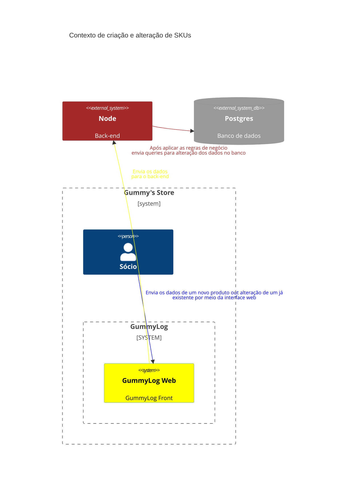
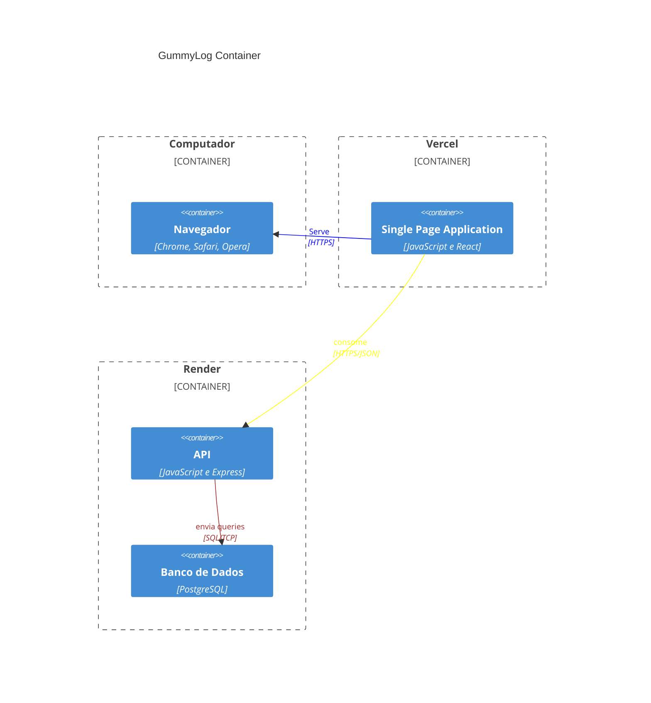

# Fluxo de criação e alteração de SKUs

## Contexto

```mermaid
C4Context
    title Contexto de criação e alteração de SKUs

    Boundary(GS, "Gummy's Store") {
        Person(partnerA, "Sócio")

        System_Boundary(GL, "GummyLog") {
            System(GLS, "GummyLog Web", "GummyLog Front", $bgColor="yellow", $fontColor="black")
        }
    }
    System_Ext(back, "Node", "Back-end", $bgColor="brown")
    SystemDb_Ext(db, "Postgres", "Banco de dados")

Rel(partnerA, GLS, "Envia os dados de um novo produto out alteração de um já <br> existente por meio da interface web")
UpdateRelStyle(partnerA, GLS, $lineColor="blue", $textColor="blue", $offsetY="-60")
Rel(GLS, back, "Envia os dados <br> para o back-end")
UpdateRelStyle(GLS, back, $lineColor="yellow",$textColor="yellow", $offsetY="-190")
Rel(back, db, "Após aplicar as regras de negócio <br> envia queries para alteração dos dados no banco")
UpdateRelStyle(back, db, $lineColor="brown", $textColor="brown", $offsetY="50", $offsetX="-100")

```

## Container

```mermaid
C4Container

title GummyLog Container

Container_Boundary(f3, "Computador") {
    Container(f4, "Navegador", "Chrome, Safari, Opera")
}

Container_Boundary(f1, "Vercel") {
    Container(spa, "Single Page Application", "JavaScript e React")
}
Container_Boundary(f2, "Render") {
    Container(back, "API", "JavaScript e Express")
    Container(db, "Banco de Dados", "PostgreSQL")
}

Rel(spa, f4, "Serve", "HTTPS")
UpdateRelStyle(spa, f4, $lineColor="blue", $textColor="blue", $offsetX="-20", $offsetY="-10")

Rel(spa, back, "consome", "HTTPS/JSON")
UpdateRelStyle(spa, back, $lineColor="yellow", $textColor="yellow")

Rel(back, db, "envia queries", "SQL/TCP")
UpdateRelStyle(back, db, $lineColor="brown", $textColor="brown", $offsetX="-35", $offsetY="20")
```
