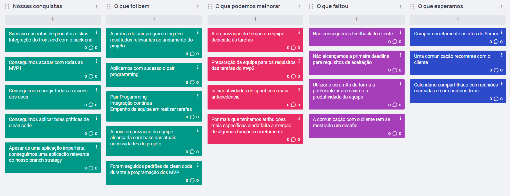

# Registros de reuniões

## Sprint 3 Planning

Durante a planning revisamos os cards que irão para essa sprint.

Cards inseridos: US01, US02 US03 e US10

## Reunião de Checkpoint

Durante a reunião de checkpoint fizemos novos acordos e reestabelecemos as funções de cada um no time.

Atribuições:
* Tech Lead: Adriano
* Frontend: Hauedy 
* Backend: Amaral
* DevMaster: Sebastian 
* CI-tester: João Vitor

Descrição das atribuições:
* Tech Lead -> Pessoa responsável por tomar decisões técnicas do projeto, e auxiliar as outras partes no desenvolvimento do projeto, assim como revisar códigos e validar.
* FrontEnd -> Responsável por colocar em código a interface do projeto e realizar as devidas integrações com o backend.
* BackEnd -> Parte responsável por codificar as regras de negócios, endpoints e a comunicação com o banco de dados, assim como desenhar o banco de dados e realizar a comunicação do banco com o backend.
* DevMaster -> Responsável por gerenciar o backlog, estabelecer regras de negocio e comunicação com o cliente.
* CI-Tester -> Responsável por estabelecer os fluxos de integração continua e codificar os testes para validação dos códigos.

## Review Sprint 3

Durante a Sprint tivemos alguns percalços que impediram que todos os cards fossem entregues por completo.

Nosso Back-End e nossa Esteira de CI foram adequadas, entretanto não conseguimos entregar uma interface de usuário completa. Tendo apenas a US02 devidamente entregue.

## Retrospective Sprint 3

Fizemos uma reunião usando o EasyRetro como quadro. Os resultados foram:

## Sprint 4 Planning

### Revisão do backlog do produto:

#### Histórias do usuário concluídas:
* US02

#### Histórias de usuário não concluídas:
* US01
* US10
* US03

US08 pasada para MVP2

US09 eliminada

### Objetido do sprint:

* Completar US01:
Eu, como usuário, quero preencher um formulário que irá registrar um novo produto em meu estoque, para 
poder fazer um melhor controle dos produtos que tenho disponíveis

* Completar US10:
Eu, como usuário, quero inserir uma nova quantidade em um produto já existe no estoque a fim de manter 
o histórico de um produto que já foi cadastrado anteriormente e ter uma noção de como meu estoque realmente 
está.

* Completar US03:
Eu, como usuário, quero receber notificações dentro da aplicação e por e-mail quando o estoque de um dos 
meus produtos estiver baixo para que eu não esqueça de reabastecer o estoque desse produto.

* US08: Eu, como usuário, quero recuperar minha conta por e-mail para não perder acesso aos meus dados 
do GummyLog.

* US11: Eu, como usuário, quero registrar uma venda para reservar a saída de um produto do meu estoque a fim de 
não correr o risco de fazer vendas sem o produto em estoque.

* US13: Eu, como usuário, quero visualizar um dashboard com métricas de entrada e saída de produtos a fim de 
ter uma melhor noção de como meu negócio está se saindo

* US14: Eu, como usuário, quero escolher para qual e-mail as notificações serão enviadas a fim de manter as notificações 
centralizadas em um endereço reservado para essa finalidade.

* US04: Eu, como usuário, quero alterar o status dos produtos em estoque a medida que as vendas forem andando para poder ter 
controle do meu processo de retirada do estoque e entrega para o cliente

* US12: Eu, como usuário, quero receber sugestões de qual unidade de armazenamento um produto deve ser retirado para reduzir 
os custos de uma entrega.

* US05: Eu como usuário quero realizar autenticação através do endereço de e-mail cadastrado a fim de manter meus dados seguros 
com minhas credenciais.
	
* US06: Eu como usuário quero criar uma conta no GummyLog usando meu endereço de e-mail para ter mais controle sobre a minha conta.

* Definir e implementar estrategia de testes e testes unitarios para front-end y back-end

### Definition of ready:

- A atividade proposta é possível de ser realizada na duração de uma Sprint

- Atividades que são requisitos para esta finalizadas

- Spikes realizadas para cumprir os requisitos técnicos da funcionalidade, quando necessário

- Histórias de usuário refinadas pelo time:

- História e sua pontuação de priorização reavaliados
	* Eventuais correções/atualizações feitas para adequa-la ao estado atual do projeto

#### Cumpre com a definition of ready:

* US11
* US14
* US04
* US05
* US06

#### Não cumpre com a definition of ready:

US12 não entra no DOR: 
* Não são atividades que são requisitos para esta finalizadas.
* Não tem spikes realizadas para cumprir os requisitos técnicos da funcionalidade, quando necessário.
		
US13 não entra no DOR: 
* Não são atividades que são requisitos para esta finalizadas.
* Não tem spikes realizadas para cumprir os requisitos técnicos da funcionalidade, quando necessário.

### Definir o sprint backlog:

US01:
* Desenvolver interface de usuário
* Funcionalidade de enviar dados para database
* Validar os dados antes do envio
* Delimitar os campos obrigatórios

US10:
* Desenvolver interface de usuário
* Funcionalidade de atualização de dados
* Validar os dados inseridos	
* Funcionalidade de confirmação manual

US03:
* Definir que constitui um baixo estoque
	
US11:
* Desenvolver interface de usuário
* Funcionalidade de enviar dados para database
* Validar os dados antes do envio
* Delimitar os campos obrigatórios
* Funcionalidade de atualização de dados de database
	
US14:
* Desenvolver interface de usuário
* Funcionalidade de atualização de email
* Validação do email inserido
* Funcionalidade de enviar e-mail de teste

US04:	
* Funcionalidade de captar eventos de outros processos
* Funcionalidade de atualização automática dos dados da database
	
US05:
* Funcionalidade de enviar e mail de recuperação
	
US06:
* Desenvolver interface de usuário
* Validar os dados inseridos
* Funcionalidade de criar usuário na database

## Reunião de feedback com o cliente - 07/12/2023

### Feedback dos MVPs:

### Feedback do US02:

### Feedback do US03:

### Feedback da estrutura do banco de dados:

## Sprint 4 Review

### Sprint backlog items:

US01:
* Desenvolver interface de usuário
* Funcionalidade de enviar dados para database
* Validar os dados antes do envio
* Delimitar os campos obrigatórios

US10:
* Desenvolver interface de usuário
* Funcionalidade de atualização de dados
* Validar os dados inseridos	
* Funcionalidade de confirmação manual

US03:
* Definir que constitui um baixo estoque
	
US11:
* Desenvolver interface de usuário
* Funcionalidade de enviar dados para database
* Validar os dados antes do envio
* Delimitar os campos obrigatórios
* Funcionalidade de atualização de dados de database
	
US14:
* Desenvolver interface de usuário
* Funcionalidade de atualização de email
* Validação do email inserido
* Funcionalidade de enviar e-mail de teste

US04:	
* Funcionalidade de captar eventos de outros processos
* Funcionalidade de atualização automática dos dados da database
	
US05:
* Funcionalidade de enviar e mail de recuperação
	
US06:
* Desenvolver interface de usuário
* Validar os dados inseridos
* Funcionalidade de criar usuário na database

### SBI's aprovados:

US1:
* Validar os dados antes do envio
* Delimitar os campos obrigatórios
* Desenvolver interface de usuário

US06:
* Desenvolver interface de usuário
* Validar os dados inseridos
* Funcionalidade de criar usuário na database

US03:
* Definir que constitui um baixo estoque

US11:
* Desenvolver interface de usuário
* Validar os dados antes do envio
* Delimitar os campos obrigatórios

US14:
* Funcionalidade de atualização de email

US05:
* Funcionalidade de enviar e mail de recuperação

US10:
* Funcionalidade de atualização de dados

### Mudanças no ambiente:

Não houve mudança no ambiente.

### O que fazer:

* Apresentar produto completo ao cliente para receber feedback.

* Aplicar feedback recebido ao produto.

* Realizar testes em um ambiente específico para verificar as funcionalidades do produto.

## Sprint 4 retrospective:

### O que deu certo:

* Desta vez se pôde ser possível realizar reuniões com o cliente para adquirir feedback.

* Houve um aumento na disponibilidade dos membros da equipe.

* Boa aplicação contínua de pair programming e clean code.

### O que não deu certo:

* O trabalho foi concluído muito perto da data de entrega.

* Preparação para a apresentação não foi muito extensa.

* Falha ao apresentar o produto completo ao cliente.

### Planos de ação e metas:

* Preparar explicações sobre as diferentes funcionalidades do aplicativo com antecedência para que possam ser traduzidas e apresentadas ao cliente.