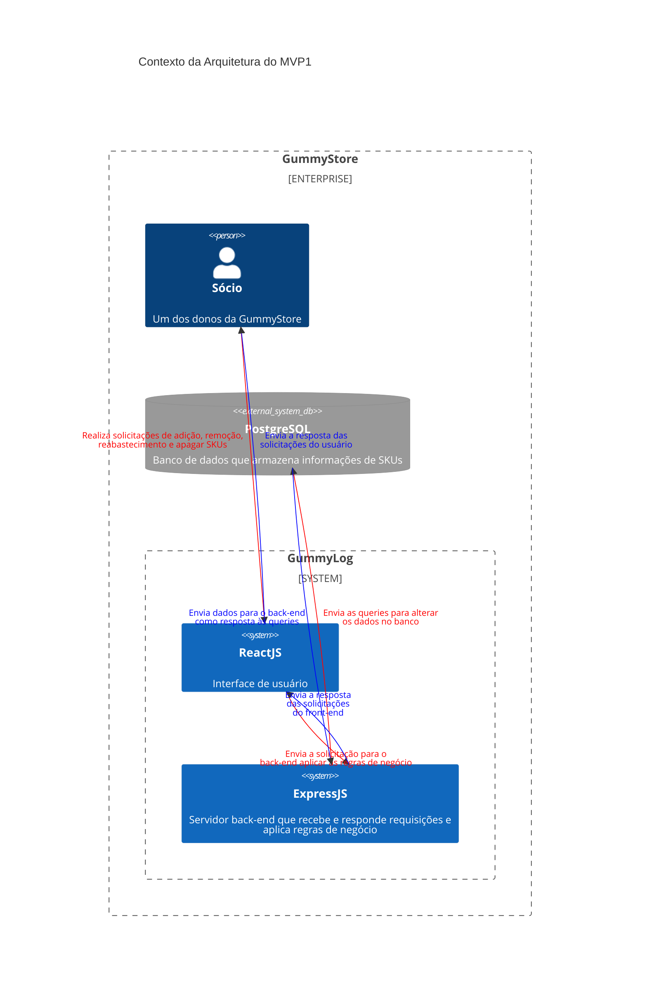

# Arquitetura do produto

A arquitetura Cliente-server é composta por dois componentes, o fornecedor, o qual se encarrega de prover os serviços e o consumidor, o qual usa os serviços.

Nesta arquitetura podem existir vários clientes conectados a um único servidor para recuperar os recursos necessários para funcionar.

O cliente neste caso é apenas uma camada para mostrar os dados, é o servidor que faz todas as tarefas pesadas, porém ambas as partes são igualmente importantes, o cliente é completamente inutil se o servidor não estiver disponível e o servidor sozinho não poderia ser usado. 

A arquitetura Client-server no caso do GummyLog funciona da seguinte maneira o usuário, neste caso um membro do GummyStore, realiza um pedido através de uma interface no ReactJS, depois desta interface envia solicitações ao sistema de back-end que usa ExpressJS, este se encarregará de conectar a parte de front-end com o servidor SQL, posteriormente se envia as querendo ao servidor que responde com dados, logo a parte de back-end envia estes dados à parte front-end para que o usuário possa visualizá-los.

# Justificativa

Este modelo foi escolhido de entre muitos outros, já que se alinha melhor às necessidades do programa, em formas que se descreverão a seguir.

## Consistência dos dados:

Porque a informação reflete o estoque físico de produtos e as ordens recebidas não podem ser perdidas uma vez que o programa é fechado, existem muitas maneiras de fazer isso, mas nós escolhemos o modelo cliente-servidor, que seria um servidor central, isto é bem-vindo com os benefícios de ter a data centralizada, pelo que é mais fácil assegurá-la e prover autorizações a usuários.

## Compartilhamento:

Atualmente existem 2 membros na equipe de GummyStore, estes 2 precisarão ter acesso aos dados em lugares distantes e em computadores separados, não somente computadores mas também podem ser telefones celulares, para garantir o acesso aos dados independentemente do local e do dispositivo utilizado será utilizado o servidor centralizado da arquitetura Client-Server para lidar com os dados.

## Requests:

A maioria das funcionalidades da aplicação são de modificação, leitura e eliminação de dados coisas nas quais a arquitetura Client-Server destaca-se.

## Escalabilidade:

GummyStore pretende expandir-se no futuro, por isso é necessário autenticar mais usuários e armazenar mais produtos, em uma arquitetura onde toda essa informação é centralizada é muito mais fácil realizar as mudanças necessários.

## Funcionalidade:

Permite que com buscas mais específicas que limitam os resultados na base de dados, se possa realizar uma filtragem dos dados realizada pelo servidor e estes sejam enviados à aplicação a qual simplesmente deve mostrá-los.

