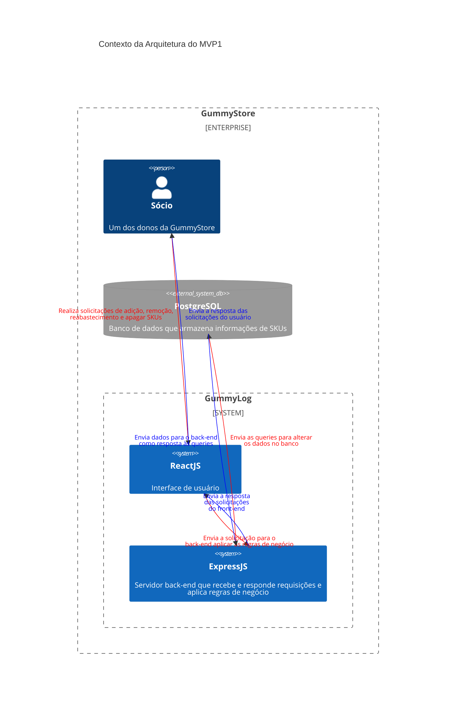

# Arquitetura do produto

```mermaid
C4Context
title Contexto da Arquitetura do MVP1

Enterprise_Boundary(g0, "GummyStore") {
    Person(Partner, "Sócio", "Um dos donos da GummyStore")

    System_Boundary(g1, "GummyLog") {
        System(SystemB, "ReactJS", "Interface de usuário")
        System(SystemA, "ExpressJS", "Servidor back-end que recebe e responde requisições e <br/> aplica regras de negócio")
    }
    SystemDb_Ext(DB, "PostgreSQL", "Banco de dados que armazena informações de SKUs")

    Rel(Partner, SystemB, "Realiza solicitações de adição, remoção, <br/> reabastecimento e apagar SKUs")
    UpdateRelStyle(Partner, SystemB, $lineColor="red", $textColor="red", $offsetX="-235", $offsetY="-50")
    
    Rel(SystemB, SystemA, "Envia a solicitação para o <br/> back-end aplicar as regras de negócio")
    UpdateRelStyle(SystemB, SystemA, $lineColor="red", $textColor="red", $offsetY="40", $offsetX="-80",)
    
    Rel(SystemA, DB, "Envia as queries para alterar <br/> os dados no banco")
    UpdateRelStyle(SystemA, DB, $lineColor="red", $textColor="red", $offsetX="15")
    
    Rel(DB, SystemA, "Envia dados para o back-end <br/> como resposta às queries")
    UpdateRelStyle(DB, SystemA, $lineColor="blue", $textColor="blue", $offsetX="-170")

    Rel(SystemA, SystemB, "Envia a resposta <br/> das solicitações <br/> do front-end")
    UpdateRelStyle(SystemA, SystemB, $lineColor="blue", $textColor="blue", $offsetY="-35", $offsetX="-45")

    Rel(SystemB, Partner, "Envia a resposta das <br/> solicitações do usuário")
    UpdateRelStyle(SystemB, Partner, $lineColor="blue", $textColor="blue", $offsetY="-50", $offsetX="10")
}

```