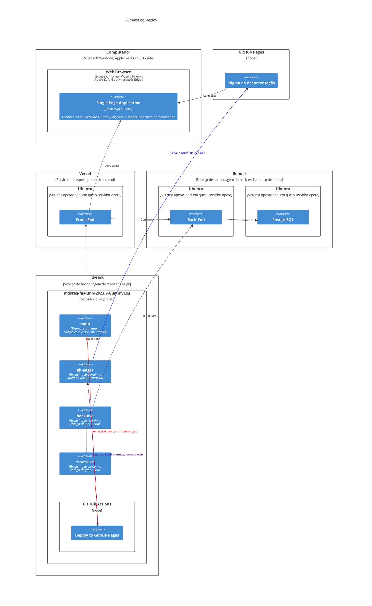

# Integração Contínua e Branch Strategy
## Branch Strategy

Teremos 8 tipos de branches:
- **main**: Branch principal do repositório, em que ficará hospedado o código raw da documentação
- **back-live**: branch em que ficará hospedado o código raw do back-end
- **front-live**: branch em que ficará hospedado o código raw do front-end
- **gh-pages**: branch usada pelo github para servir a build da documentação
- **Release/Unidade[Número da únidade]/Destino (back/front/pages)**: Branch em que iremos realizar testes antes de todos os deploys
- **Feature/[Referência do item no backlog]**: Branch em que serão desenvolvidas histórias de usuário
- **Issue/#[Número da Issue]**: Branch em que as Issues serão resolvidas
- **Fix/[Referência do item no backlog]**: Branch em que serão desenvolvidos fixes no código

```mermaid

gitGraph
    commit
    branch back-live
    branch front-live
    branch gh-pages
    branch "Release/Unidade2/pages"
    checkout "Release/Unidade2/pages"
    commit
    branch "Feature/[E1-US2]"
    commit
    commit
    commit
    checkout "Release/Unidade2/pages"
    merge "Feature/[E1-US2]"
    checkout main
    merge "Release/Unidade2/pages"
    commit
    checkout gh-pages
    merge main
    checkout back-live
    commit
    branch Release/Unidade2/back
    commit
    branch "Fix/[E1-US2]"
    commit
    commit
    commit
    checkout Release/Unidade2/back
    merge "Fix/[E1-US2]"
    checkout back-live
    merge Release/Unidade2/back
    checkout front-live
    commit
    branch Release/Unidade2/front
    commit
    branch "Issue/#23"
    commit
    commit
    commit
    checkout Release/Unidade2/front
    merge "Issue/#23"
    checkout front-live
    merge Release/Unidade2/front
    
```

## Integração Contínua

### Documentação
Nossa documentação é feita usando o Docussaurus, que realiza uma build e serve ela para o github pages por meio do github Actions. Sempre que uma branch com nome iniciado em "Release" é criada, ela passa a ser assistida pelo github actions, que roda uma série de jobs de testes para estabelecer se a branch de Release está apta ou não para ir para produção sempre que um commit for feito na branch. Sempre que um commit for feito na branch main, o github Actions roda o job de build e serve que irá disponibilizar a build no github pages por meio da branch gh-pages.

### Back-end
Nosso back-end é feito com o ExpressJS e será hospedado no Render - um serviço de hospedagem de serviços web - e o ambiente de produção ficará localizado na branch back-live, que será assistida pelo Render. Sempre que um commit por feito para a banch assistida ele irá rodar os jobs que irão buildar e servir o serviço na plataforma.

### Front-end
Nosso front-end é feito com ReactJS e será hospedado no Vercel - um serviço de hospedagem similar ao Render, mas com foco maior em front-end - e o ambiente de produção ficará localizado na branch front-live, que, da mesma forma, será assistida pelo serviço responsável (Vercel). Da mesma forma, sempre que um commit for feito para o ambiente de produção ele irá rodar os jobs responsáveis por buildar e servir a página.

### Banco de dados
Nosso banco de dados ficará hospedado no Render, as migrations serão feitas manualmente por não ser possível capacitar todo o time a usar ORMs para automação dessa tarefa.


