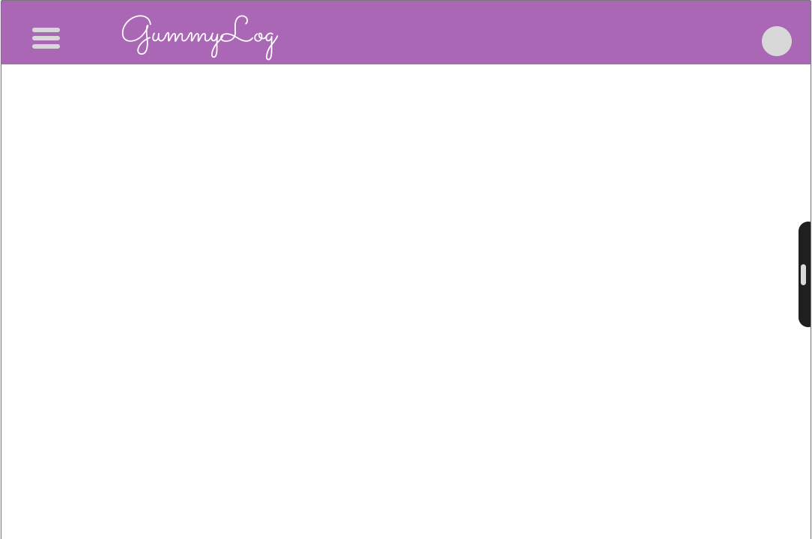
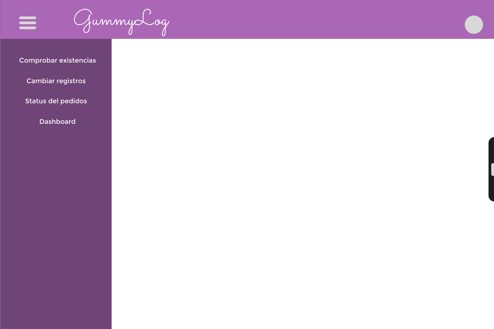
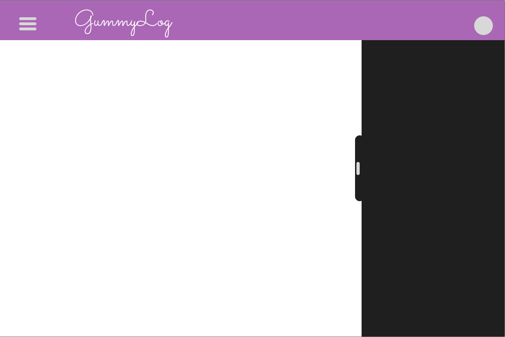
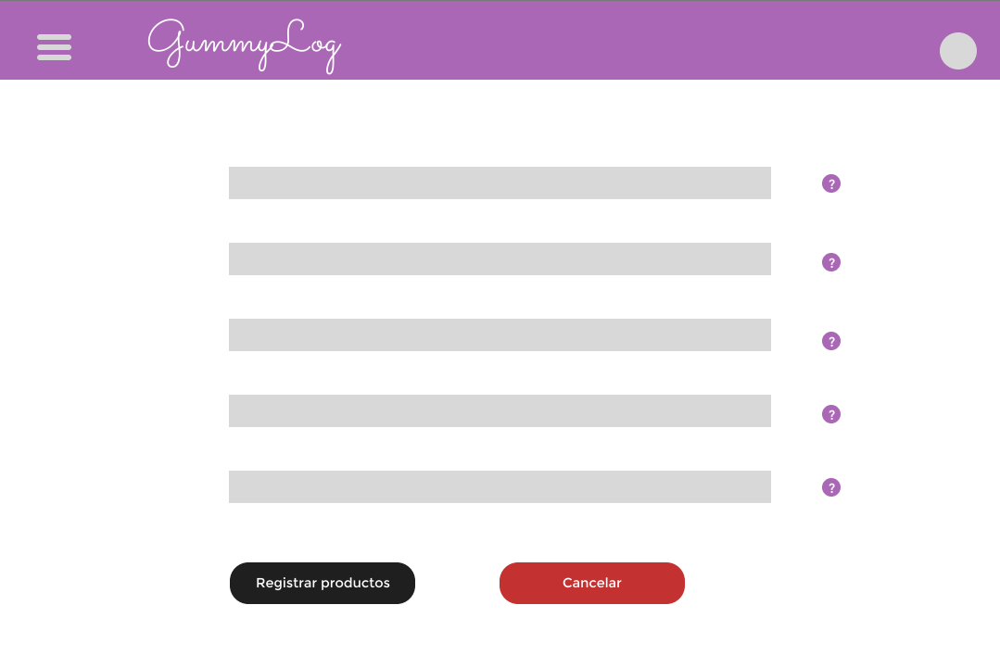
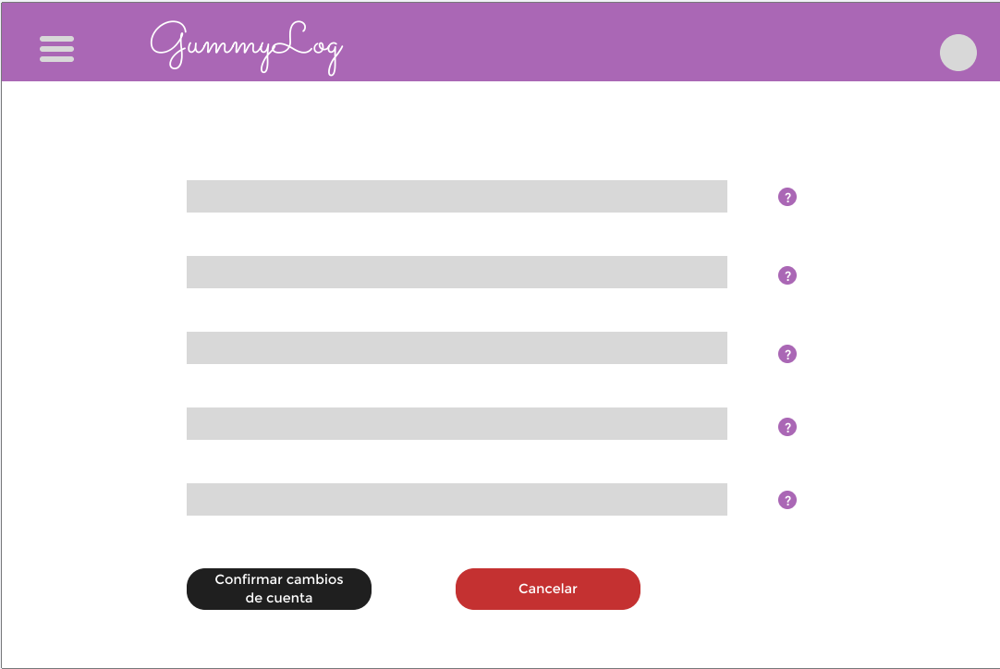

# Processos de Desenvolvimento de Software

## 3.1 - Cerimônias de Scrum

| Nome da Atividade | Método | Ferramenta | Entrega |
|-------------|-------------|-------------|-------------|
| Planning | Reunião online via Discord| Trello e Discord | Cards criados, com estórias de usuário e pontos de estória atribuídos e movimentação de tarefas do backlog para a Sprint |
| Checkpoint| Reunião online via Discord segunda e quarta. Devido a falta de disponibilidade dos membros em fazer a Daily, optamos por fazer duas reuniões um pouco mais extensas duas vezes por semana | Discord| Ata da reunião contendo progresso, problemas encontrados e planejamento |
| Reunião com cliente| Reunião online via Discord aos domingos | Discord | Ata da reunião |
| Review| Reunião online via Discord ao final de cada Sprint | Trello e Discord | Ata da reunião com relatório da Sprint |
| Retrospectiva| Reunião online via discord ao final de cada | Discord | Ata da reunião com quadro da retrospectiva |
| Daily Scrum | **Não serão realizadas** as cerimônias de Daily Scrum tendo em vista a incompatibilidade de horário dos membros da equipe |

 

## Praticas XP a ser utilizadas

| Práticas XP      | Onde vai ser utilizado | Justificativa |
| ----------- | ----------- |-----------|
| TDD (Test Driven Development)      | Desenvolvimento       | O TDD será usado porque ajudará na detecção precoce de erros no código (bugs ou erros lógicos), o que impede que eles causem problemas quando o programa for mais complexo. Isso garante que cada entrega do programa seja 100% funcional. |
| Pair programming   | Desenvolvimento        | Será utilizado no caso de alguém ter problemas para desenvolver alguma parte do projeto, os membros da equipe têm diferentes níveis de experiência em diversos temas, devido a este um problema que para um membro pode ser muito complicado para outro pode ser mais simples, enquanto fisicamente trabalhar em um único computador não é possível, se pode usar a função de compartilhamento de tela em Discord como uma alternativa. |
| Integração contínua   | Desenvolvimento        | Será usado para evitar a integração de código longo e complexo que pode levar muito tempo do ciclo de desenvolvimento, realizar a integração enquanto o código é mais simples evitará muitos problemas. |
| Testes de Aceitação   | Planning        | Os testes de aceitação ajudar-nos-ão a concentrar-nos nas partes que são realmente importantes e a evitar aditamentos desnecessários e sem valor. |
| Pequenos lançamentos   | Final do ciclo        | Pequenos lançamentos nos ajudarão a não realizar entregas muito grandes e complexas, estas devem ser o menor possível para que sejam mais compreensíveis para o resto da equipe |
| Metáfora   | Reunião com cliente        | O cliente não é uma pessoa que tenha muita experiência com temas técnicos relacionados ao software, por isso se utilizará a metafora para tentar um melhor entendimento dos funcionamentos do programa. |
| Posse Coletiva   | Desenvolvimento        | Acesso total de todos os membros da equipe a todas as partes do projeto permite analisar o código e ter um melhor entendimento do que os outros fizeram para facilitar a integração, além de facilitar a busca de erros. |
| Padrões de Codificação   | Planning        | Ajudará a ter um codigo mais simples e legível, para que se facilite aos membros da equipe entender que faz cada parte do codigo.  |
| Design Simples   | Todas as fases        | Vai ajudar a evitar que o código seja demasiado complicado para garantir que este corre rapidamente. |
| Refatoração   | Review        | Além de ajudar a manter o código limpo, este é um requisito de muitas das práticas XP que vamos usar. |
| Jogo do Planejamento   | Não será usado        | Isto não será usado já que o tempo com o cliente é limitado e consideramos que o jogo de planejamento leva muito tempo o que pode afetar negativamente a produtividade das reuniões. |
| Ciclo semanal   | Não será usado        | Consideramos que os membros desta equipa não têm tempo suficiente para completar um ciclo de desenvolvimento em apenas uma semana. |
| Cliente presente   | Não será usado        | A disponibilidade do cliente não permite que esta prática seja aplicada. |
| Ritmo sustentável   | Não será usado        | Devido à imprevisibilidade das atividades semanais correspondentes a outros cursos, consideramos que é impossível ter um número de horas fixas por semana.|

## Backlog de Requisitos

### Mapeamento de personas 

| Persona | Descrição |
| ----------- | ----------- |
| Usuário | Refere-se aos dois sócios  da Gummy's Store |

### Requisitos Funcionais:

* **Valor de Negócio:** O Valor de Negócio se refere à importância ou benefício que uma tarefa, história de usuário, funcionalidade ou projeto tem para a organização, clientes ou partes interessadas. É a medida do valor ou impacto que a conclusão da tarefa terá no sucesso geral do projeto. Tarefas ou funcionalidades com alto Valor de Negócio geralmente são priorizadas, pois contribuem significativamente para os objetivos gerais da organização.

* **Viabilidade:** A Viabilidade refere-se à capacidade de realizar com sucesso uma tarefa ou projeto. Envolve a avaliação de recursos disponíveis, restrições, obstáculos potenciais e a probabilidade de sucesso. Tarefas ou projetos com alta Viabilidade são aqueles que podem ser executados com relativa facilidade, considerando os recursos disponíveis e as restrições existentes.

* **Complexidade:** A Complexidade se refere ao grau de dificuldade, intricidade ou desafio associado a uma tarefa, projeto ou funcionalidade. Tarefas de alta Complexidade são aquelas que envolvem múltiplos componentes, etapas intricadas ou requisitos técnicos avançados, tornando-as mais difíceis de serem concluídas. A Complexidade também pode estar relacionada à incerteza e à necessidade de superar desafios específicos durante a execução.

| Valor de Fibonacci | Valor de Negocio     | Viabilidade      | Complexidade   |
|-------------------|-----------------------|-----------------------|-----------------------|
| 0                 | Sem valor de negócio  | Não Viável | Pouca Complexidade |  
| 1                 | Mais baixo valor de negócio. | Pouco Viável | Mais Baixa Complexidade, dominio de tecnologia| 
| 2                 | Baixo valor de negócio  | Baixa Viabilidade | Baixa Complexidade, conhecimento da tecnologia|
| 3                 | Médio valor de negócio | Média Viabilidade | Média Complexidade, conhecimento básico da tecnologia|
| 5                 | Intermediário valor de negócio  | Vibilidade Intermediária| Complexidade Intermediaria, tarefa trabalhosa mesmo com conhecimento da tecnologia | 
| 8                 | Alto valor de negócio | Alta Viabilidade | Alta Complexidade, tarefa trabalhosa devido a nova tecnologia, mas dentro da realidade.  | 
| 13                | Muito Alto valor de negócio | Viabilidade Muito Alta | Complexidade Muito Alta, tarefa extremamente trabalhosa onde a equipe não sabe por onde começar ou qual tecnologia usar |

| Temas | Épicos | User Story |  Valor de Negocio | Viabilidade | Complexidade |  Média |
| ----------- | ----------- | ----------- | ----------- | ----------- | ----------- | --------|
| **[TE01]** Gerenciamento de Produtos | **[EP01]** Gestão de Estoque e Inventário| **[US01:]** Eu, como usuário, quero preencher um formulário que irá registrar um novo produto em meu estoque, para poder fazer um melhor controle dos produtos que tenho disponíveis | 13 | 13 | 1 | 9 |
| **[TE01]** Gerenciamento de Produtos | **[EP01]** Gestão de Estoque e Inventário | **[US02:]** Eu, como usuário, quero visualizar o estoque de produtos com informações de quantidade e localização do produto para ter noção do que tenho disponível para vender. | 13 | 8 | 3 |  8 |
| **[TE01]** Gerenciamento de Produtos | **[EP03]** Plataforma de logística com acesso restrito | **[US08:]** Eu, como usuário, quero recuperar minha conta por e-mail para não perder acesso aos meus dados do GummyLog. | 8 | 8 | 5 | 7 |
| **[TE02]**  Otimização Logistica | **[EP02]** Processamento de Pedidos e Entregas | **[US11:]** Eu, como usuário, quero registrar uma venda para reservar a saída de um produto do meu estoque a fim de não correr o risco de fazer vendas sem o produto em estoque.| 8 | 8 |  5 | 7 |
| **[TE01]** Gerenciamento de Produtos | **[EP01]** Gestão de Estoque e Inventário | **[US10:]** Eu, como usuário, quero inserir uma nova quantidade em um produto já existe no estoque a fim de manter o histórico de um produto que já foi cadastrado anteriormente e ter uma noção de como meu estoque realmente está.| 8 | 8 |  3 | 6.333 |
| **[TE02]**  Otimização Logistica | **[EP01]** Gestão de Estoque e Inventário | **[US13:]** Eu, como usuário, quero visualizar um dashboard com métricas de entrada e saída de produtos a fim de ter uma melhor noção de como meu negócio está se saindo. | 8 | 3 | 8 | 6.33 |
| **[TE01]** Gerenciamento de Produtos | **[EP01]** Gestão de Estoque e Inventário | **[US03:]** Eu, como usuário, quero receber notificações dentro da aplicação e por e-mail quando o estoque de um dos meus produtos estiver baixo para que eu não esqueça de reabastecer o estoque desse produto. | 3 | 8 | 5 | 5.333|
| **[TE02]**  Otimização Logistica | **[EP03]** Plataforma de logística com acesso restrito | **[US14:]** Eu, como usuário, quero escolher para qual e-mail as notificações serão enviadas a fim de manter as notificações centralizadas em um endereço reservado para essa finalidade. | 2 | 13 | 1 | 5.333| 
| **[TE02]**  Otimização Logistica |  **[EP02]** Processamento de Pedidos e Entregas | **[US04:]** Eu, como usuário, quero alterar o status dos produtos em estoque a medida que as vendas forem andando para poder ter controle do meu processo de retirada do estoque e entrega para o cliente. | 5 | 8 | 2 | 5 |
| **[TE02]**  Otimização Logistica |  **[EP02]** Processamento de Pedidos e Entregas | **[US12:]** Eu, como usuário, quero receber sugestões de qual unidade de armazenamento um produto deve ser retirado para reduzir os custos de uma entrega. |  3 | 3 | 8 | 4.66 |
| **[TE02]**  Otimização Logistica | **[EP03]** Plataforma de logística com acesso restrito | **[US05:]** Eu como usuário quero realizar autenticação através do endereço de e-mail cadastrado a fim de manter meus dados seguros com minhas credenciais.| 3 | 2 | 5 | 3.333|
| **[TE02]**  Otimização Logistica | **[EP03]** Plataforma de logística com acesso restrito | **[US06:]** Eu como usuário quero criar uma conta no GummyLog usando meu endereço de e-mail para ter mais controle sobre a minha conta.| 3 | 2 | 5 | 3.333|

### Requisitos Não Funcionais

| Categoria | Requisito |
| ----------- | ----------- |
| **Usabilidade** | **[RNF01]** O sistema deve ajustar dinamicamente o layout e o conteúdo para diferentes tamanhos de tela, permitindo uma visualização apropriada em telas pequenas, médias e grandes. | 
| **Confiabilidade**|  **[RNF02]** O sistema deve proporcionar um ambiente suficientemente seguro para garantir que apenas aqueles registrados no sistema tenham acesso a ele.|
| **Interface** | **[RNF03]** O sistema deve conter estilização das páginas com cores, fontes, botões e icones padronizados|
| **Usabilidade**  | **[RNF04]** O usuário deverá realizar qualquer funcionalidade no sistema com até 5 cliques| 
| **Confiabilidade**| **[RNF05]** O sistema deve registrar erros não relacionados à interação do usuário em um log e notificar a equipe responsável | 
| **Suportabilidade** | **[RNF06]** O sistema  deve ser compatível com as versões de até Novembro de 2023 dos navegadores modernos como Chrome, Safari, Edge, Firefox e Opera. |

## Critérios de Aceitação
|  User Story | Critério de Aceitação |
| ----------- | --------------------- |
| **[US01:]** Eu, como usuário, quero preencher um formulário que irá registrar um novo produto em meu estoque, para poder fazer um melhor controle dos produtos que tenho disponíveis | <ul><li>Deve existir um formulário de cadastro de produtos com seus campos obrigátorios (nome, descrição, quantidade), os quais seus conteúdos devem ser  validados. </li> <li>Após o preenchimento do formulário e êxito no envio, o produto deve ser registrado no estoque</li> <li>O sistema deve fornecer um feedback de sucesso após o registro</li> </ul>|
| **[US02:]** Eu, como usuário, quero visualizar o estoque de produtos com informações de quantidade e localização do produto para ter noção do que tenho disponível para vender. | <ul> <li>Deve existir uma página ou seção onde o usuário possa visualizar o estoque.</li> <li> O estoque deve ser apresentado de forma clara, mostrando o nome, tipo e a quantidade de cada produto e sua localização. </li> <li>As informações devem ser atualizadas em tempo real. </li> </ul> |
| **[US03:]** Eu, como usuário, quero receber notificações dentro da aplicação e por e-mail quando o estoque de um dos meus produtos estiver baixo para que eu não esqueça de reabastecer o estoque desse produto.| <ul><li>As notificações devem ser enviadas automaticamente quando o estoque de um produto estiver baixo. </li> </ul> | 
| **[US04:]** Eu, como usuário, quero alterar o status dos produtos em estoque a medida que as vendas forem andando para poder ter controle do meu processo de retirada do estoque e entrega para o cliente.| <ul> <li> As alterações de status devem ser registradas e refletidas no estoque atual. </li> <li> Deve existir uma opção para o usuário alterar o status (entregue, cancelado, em processo de entrega) dos produtos  no estoque após uma venda. </li></ul> |
| **[US05:]** Eu como usuário quero realizar autenticação através do endereço de e-mail cadastrado a fim de manter meus dados seguros com minhas credenciais |  <ul> <li> Deve existir um sistema de autenticação que permite ao usuário entrar na sua conta usando o endereço de e-mail cadastrado. </li> <li> A autenticação deve ser suficientemente segura e proteger os dados do usuário. </li> </ul> |
| **[US06:]** Eu como usuário quero criar uma conta no GummyLog usando meu endereço de e-mail para ter mais controle sobre a minha conta. | <ul> <li> Deve existir um processo de criação de conta que permita ao usuário registrar-se usando o seu endereço de e-mail</li> <li>O processo de criação de conta deve ser intuitivo e obrigatório para uso do GummyLog.</li> </ul> |
| **[US08:]** Eu, como usuário, quero recuperar minha conta por e-mail para não perder acesso aos meus dados do GummyLog. | <ul> <li> Deve existir a opção de recuperação de conta por e-mail, contendo um campo que deve ser colocado um e-mail de recuperação.</li> <li>O usuário deve receber um e-mail com instruções para redefinir a senha, contendo um código de verificação.</li> <li>Após seguir as instruções (uso do código e redefinição da senha) usuário deve conseguir acessar sua conta novamente.</li> </ul>|
| **[US10:]** Eu, como usuário, quero inserir uma nova quantidade em um produto já existe no estoque a fim de manter o histórico de um produto que já foi cadastrado anteriormente e ter uma noção de como meu estoque realmente está. | <ul> <li>  Deve existir a opção de atualizar a quantidade de um produto no estoque. </li> <li> A atualização da quantidade deve ser registrada no histórico do produto</li> <li> O sistema deve fornecer um feedback de sucesso após a atualização. </li> </ul> |
| **[US11:]** Eu, como usuário, quero registrar uma venda para reservar a saída de um produto do meu estoque a fim de não correr o risco de fazer vendas sem o produto em estoque. | <ul> <li> Deve existir a opção de registrar uma venda no sistema pelo usuário. </li> <li>O registro da venda deve resultar na redução da quantidade disponível do produto no estoque.</li> <li>O sistema deve impedir a venda de um produto que não está em estoque.</li> </ul> |
| **[US12:]** Eu, como usuário, quero receber sugestões de qual unidade de armazenamento um produto deve ser retirado para reduzir os custos de uma entrega.| <ul> <li>O sistema deve fornecer sugestões sobre qual unidade de armazenamento é mais eficiente para retirar o produto, informando a distância e a disponibilidade do estoque.</li> <li> As sugestões devem ser baseadas em critério de distância.</li> </ul> |
| **[US13:]** Eu, como usuário, quero visualizar um dashboard com métricas de entrada e saída de produtos a fim de ter uma melhor noção de como meu negócio está se saindo | <ul> <li>O usuário poderá acessar um dashboard que apresenta métricas de entrada e saída de produtos.</li> <li>As métricas devem ser exibidas de forma clara e compreensível, com gráficos, dados de entradas e saídas de mercadorias.</li> <li> As métricas devem ser atualizadas em tempo real.</li> </ul> |
| **[US14:]** Eu, como usuário, quero escolher para qual e-mail as notificações serão enviadas a fim de manter as notificações centralizadas em um endereço reservado para essa finalidade. | <ul> <li>O usuário deverá preencher um campo com endereço de email afim de receber suas notificações. </li> <li>O sistema deve enviar notificações apenas para o endereço de e-mail escolhido pelo usuário.</li> </ul>

## MVPs

### MVP1

| Tema | Épico | User Story |   
| ----------- | ----------- |----------- |
|**[TE01]** Gerenciamento de Produtos | **[EP01]** Gestão de Estoque e Inventário | **[US01:]** Eu, como usuário, quero preencher um formulário que irá registrar um novo produto em meu estoque, para poder fazer um melhor controle dos produtos que tenho disponíveis| 
| **[TE01]** Gerenciamento de Produtos | **[EP01]** Gestão de Estoque e Inventário | **[US02:]** Eu, como usuário, quero visualizar o estoque de produtos com informações de quantidade e localização do produto para ter noção do que tenho disponível para vender. |
| **[TE01]** Gerenciamento de Produtos | **[EP03]** Plataforma de logística com acesso restrito | **[US08:]**  Eu, como usuário, quero recuperar minha conta por e-mail para não perder acesso aos meus dados do GummyLog. |
| **[TE01]** Gerenciamento de Produtos | **[EP01]** Gestão de Estoque e Inventário | **[US10:]** Eu, como usuário, quero inserir uma nova quantidade em um produto já existe no estoque a fim de manter o histórico de um produto que já foi cadastrado anteriormente e ter uma noção de como meu estoque realmente está. |
| **[TE01]** Gerenciamento de Produtos | **[EP01]** Gestão de Estoque e Inventário | **[US03:]** Eu, como usuário, quero receber notificações dentro da aplicação e por e-mail quando o estoque de um dos meus produtos estiver baixo para que eu não esqueça de reabastecer o estoque desse produto. |

###  MVP2
| Tema | Épico | User Story |   
| ----------- | ----------- |----------- |
| **[TE02]** Otimização Logistica |  **[EP02]** Processamento de Pedidos e Entregas | **[US11:]** Eu, como usuário, quero registrar uma venda para reservar a saída de um produto do meu estoque a fim de não correr o risco de fazer vendas sem o produto em estoque.|
| **[TE02]** Otimização Logistica | **[EP01]** Gestão de Estoque e Inventário | **[US13:]** Eu, como usuário, quero visualizar um dashboard com métricas de entrada e saída de produtos a fim de ter uma melhor noção de como meu negócio está se saindo|
| **[TE02]**  Otimização Logistica | **[EP03]** Plataforma de logística com acesso restrito | **[US14:]** Eu, como usuário, quero escolher para qual e-mail as notificações serão enviadas a fim de manter as notificações centralizadas em um endereço reservado para essa finalidade. |
| **[TE02]**  Otimização Logistica | **[EP02]** Processamento de Pedidos e Entregas | **[US04:]** Eu, como usuário, quero alterar o status dos produtos em estoque a medida que as vendas forem andando para poder ter controle do meu processo de retirada do estoque e entrega para o cliente |
| **[TE02]**  Otimização Logistica  | **[EP02]** Processamento de Pedidos e Entregas | **[US12:]** Eu, como usuário, quero receber sugestões de qual unidade de armazenamento um produto deve ser retirado para reduzir os custos de uma entrega. |
| **[TE02]**  Otimização Logistica | **[EP03]** Plataforma de logística com acesso restrito | **[US05:]** Eu como usuário quero realizar autenticação através do endereço de e-mail cadastrado a fim de manter meus dados seguros com minhas credenciais.|
| **[TE02]**  Otimização Logistica | **[EP03]** Plataforma de logística com acesso restrito | **[US06:]** Eu como usuário quero criar uma conta no GummyLog usando meu endereço de e-mail para ter mais controle sobre a minha conta.|

# Definição de ready e done

**Definição de ready(DOR)** 

- A atividade proposta é possível de ser realizada na duração de uma Sprint

- Atividades que são requisitos para esta finalizadas

- Spikes realizadas para cumprir os requisitos técnicos da funcionalidade, quando necessário

- Histórias de usuário refinadas pelo time:
    - História e sua pontuação de priorização reavaliados
    - Eventuais correções/atualizações feitas para adequa-la ao estado atual do projeto

**Definição de done(DOD)**

- História de usuário cumprida:
    - Valor de negócio da história foi de fato agregado ao produto
    - Critérios de aceitação da história atendidos

- Funcionalidade testada por meio de testes de integração, unitários e, quando necessário, ponta a ponta

- O código segue as convenções de codificação, arquitetura e desing feitas pela equipe e não apresenta erros de liting

# Padrões de UI

**Padrões e princípios**

* Utilização da identidade visual do negócio na interface: familiaridade do usuário.

* Uso de um padrão de cores em relação a notificações e warnings: aprendizagem, familiaridade do usuário, consistência, surpresa mínima e recuperabilidade.

* Uso de perguntas de confirmação para o usuário em determinadas ações: aprendizagem, consistência, surpresa mínima.

* A língua nativa dos usuários será a padrão da interface: aprendizagem e familiaridade do usuário.

* Acesso a uma funcionalidade exigirá do usuário até 5 cliques: aprendizagem e consistência.

* Ajuda textual em botões e campos de preenchimento: orientação ao usuário.

**Modalidade das interações**

* Resposta da questão: alteração nas quantidades de produtos, nos status de pedidos, por exemplo.

* Seleção do menu: menus de ações a serem tomadas e/ou informações a serem exibidas.

* Preenchimento de formulário: no cadastro de novos itens, por exemplo.

**Paleta de cores e fonte**

* Geral: cinza(201F1F), branco(FFFFFF), tons de lilás(AA67B5, 704577).

* Warnings e notificações: vermelho(C53131), laranja(F47933), verde(308E2E).

## Referências bibliográficas

- O Guia do Scrum, Ken Schwaber e Jeff Sutherland
- Extreme Programming Explained: Embrace Change,  Kent Beck e Cynthia Andres
- Slides Métodos de Desenvolvimento de Software - Desing de Interface, George Marsicano