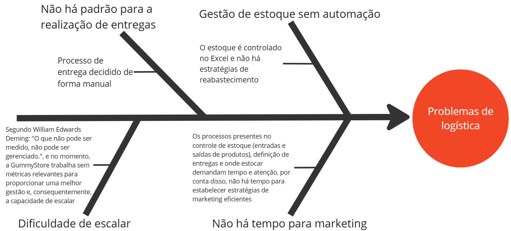
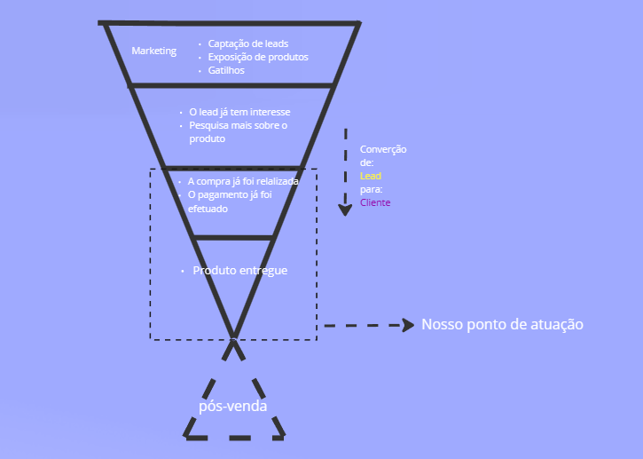

# Visão geral do produto

## 1.1 - Problema

O proprietário da loja Gummy's Store relata que não consegue expandir seu negócio. O processo de captação de clientes é realizado apenas pelo Instagram, sem investimentos em Marketing e sem definição de estratégias de crescimento por tráfego orgânico. Ao ir mais a fundo é possível identificar o por quê de não haver o investimento ou definição de estratégias em marketing: todas as tarefas, desde a venda com o cliente até a entrega dos produtos é realizada de forma manual. Além disso, não há procedimentos de pós-venda para fidelização de clientes.  Todos esses fatores culminam em uma empresa com muito trabalho manual para apenas os dois sócios proprietários da loja. Dada a análise, o cliente deseja automatizar parte dos processos logísticos para que sua empresa atinja todo o seu potencial.

 
 

 

 ## 1.2 - **Declaração de posição do produto** 
A GummyLog é um produto de logística que tem como objetivo automatizar tarefas, que antes eram feitas de forma manual, para que o proprietário da loja possa focar no que fará o seu negócio crescer. Os sócios e proprietários da Gummy’s Store desejam ter mais tempo para focar em marketing e captação de possíveis clientes mas sem depender de altas taxas de e-commerces e marketplaces – que variam entre 10 a 15% – por meio de uma ferramenta com recursos mais direcionados a suas dores e que vai solucionar as dificuldades em gerenciar uma empresa do varejo.

**1.** Qual é o produto que você se propõe a desenvolver?

Uma ferramenta de logística que automatiza tarefas que consomem muito tempo.
    
**2.** O que torna este produto diferente dos seus concorrentes?

Ele é simples, de baixo custo de manutenção e ataca problemas mais comuns em pequenos comércios.

**3.** Quem são os usuários-alvo e clientes do produto?

Os usuários-alvo são os donos de pequenos comércios que querem ter um melhor gerenciamento logístico. Nossos clientes são dois sócios que possuem uma loja de ursos de pelúcia em Lima, Perú

**4.**Por que os clientes deveriam utilizar / comprar este produto?

Tendo um gerenciamento logístico simplificado eles poderão focar no que fará o seu negócio ter mais visibilidade e que possibilita a maior captação passiva de possíveis clientes: o marketing. No momento, eles consomem muito tempo realizando o gerenciamento de estoque e a entrega dos produtos diretamente para os clientes.

|          |          |
|--------- |--------- |
| **Para** |Suporte de logística e estoque |
|**O (nome do produto)** |GummyLog |
|**Que** |É uma aplicaçao web que facilita as operações de adição, eliminação e atualização dos produtos em estoque; permite adicionar, atualizar e revisar o estado de encomenda |
|**Ao contrário** |Softwares de armazenamento de dados como excel e Google Spreadsheets |
|**Nosso Produto** |Está melhor organizado e pode executar as tarefas de atualização de forma automática sem a necessidade de estudar VBA ou JS com o Google apps |

 

# **1.3 Objetivos do Produto**

**Objetivo geral**

Melhorar a logística da Gummy's Store, otimizando o tempo gasto nas tarefas de distribuição, armazenamento de produtos e organização de pedidos, para aumentar a eficiência operacional.

**Objetivos específicos**

* **Organizar os produtos disponíveis:** dar ao cliente uma maneira de controlar a movimentação de seus produtos atendendo as características particulares de seu negócio.

* **Melhorar a entrega:** melhorar a distribuição de mercadorias dentre os dois estoques disponíveis.

* **Melhorar reabastecimento:** proporcionar uma maneira baseada em métricas tangíveis para auxiliar o reabastecimento do estoque.

* **Permitir o foco em outras áreas:** possibilitar ao nosso cliente focar em outras partes do funil de vendas, como o marketing.

# **1.4 Tecnologias a Serem Utilizadas**

| Tecnologia  | Descrição | Documentação |
| ------------- | ------------- | ---------- |
| React  |  biblioteca front-end JavaScript de código aberto com foco em criar interfaces de usuário em páginas web.  | https://react.dev/ |
| Node  | ambiente de execução JavaScript. Com ele, o usuário pode criar aplicações sem depender do browser para isso. | https://nodejs.org/ |
| Express  | framework para Node.js que fornece recursos mínimos para construção de servidores web.   | https://expressjs.com/ |
| Javascript  | linguagem de programação interpretada estruturada, de script em alto nível com tipagem dinâmica fraca e multiparadigma.  | https://developer.mozilla.org/pt-BR/docs/Web/JavaScript |
| PostgreSQL  | gerenciador de banco de dados objeto relacional | https://www.postgresql.org/docs/ |
| RabbitMQ  | software de mensagens com código aberto  | https://www.rabbitmq.com/documentation.html |

## Referências bibliográficas

- Lean Inception: Como alinhar pessoas e construir o produto certo, Paulo Caroli
- The Sales Funnel Book: How To Multiply Your Business With Marketing Automation, Nathan Williams
