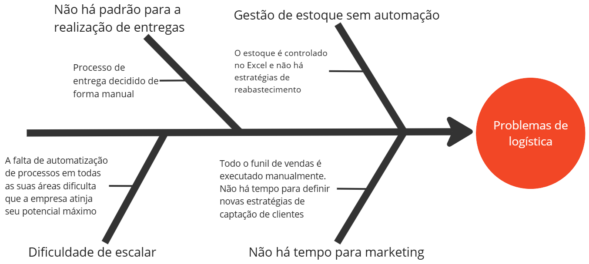

# Visão geral do produto

## 1.1 - Problema

O proprietário da loja Gummy's Store relata que não consegue expandir seu negócio. O processo de captação de clientes é realizado apenas pelo Instagram, sem investimentos em Marketing e sem definição de estratégias de crescimento por tráfego orgânico. Ao ir mais a fundo é possível identificar o por quê de não haver o investimento ou definição de estratégias em marketing: todas as tarefas, desde a venda com o cliente até a entrega dos produtos é realizada de forma manual. Além disso, não há procedimentos de pós-venda para fidelização de clientes.  Todos esses fatores culminam em uma empresa com muito trabalho manual para apenas os dois sócios proprietários da loja. Dada a análise, o cliente deseja automatizar parte dos processos logísticos para que sua empresa atinja todo o seu potencial.

 
 

 

 ## 1.2 - **Declaração de posição do produto** 
A GummyLog é um produto de logística que tem como objetivo automatizar tarefas, que antes eram feitas de forma manual, para que o proprietário da loja possa focar no que fará o seu negócio crescer. Os sócios e proprietários da Gummy’s Store desejam ter mais tempo para focar em marketing e captação de possíveis clientes mas sem depender de altas taxas de e-commerces e marketplaces – que variam entre 10 a 15% – por meio de uma ferramenta com recursos mais direcionados a suas dores e que vai solucionar as dificuldades em gerenciar uma empresa do varejo.

**1.** Qual é o produto que você se propõe a desenvolver?

Uma ferramenta de logística que automatiza tarefas que consomem muito tempo.
    
**2.** O que torna este produto diferente dos seus concorrentes?

Ele é simples, de baixo custo de manutenção e ataca problemas mais comuns em pequenos comércios.

**3.** Quem são os usuários-alvo e clientes do produto?

Os usuários-alvo são os donos de pequenos comércios que querem ter um melhor gerenciamento logístico. Nossos clientes são dois sócios que possuem uma loja de ursos de pelúcia em Lima, Perú

**4.**Por que os clientes deveriam utilizar / comprar este produto?

Tendo um gerenciamento logístico simplificado eles poderão focar no que fará o seu negócio ter mais visibilidade e que possibilita a maior captação passiva de possíveis clientes: o marketing. No momento, eles consomem muito tempo realizando o gerenciamento de estoque e a entrega dos produtos diretamente para os clientes.

|          |          |
|--------- |--------- |
| **Para** |Possui problemas de logística |
|**O (nome do produto)** |GummyLog |
|**Que** |Facilita as operações logísticas|
|**Ao contrário** |Marketplaces |
|**Nosso Produto** |Não realiza vendas, mas foca em um serviço logístico organizado e rápido |

 

# **1.3 Objetivos do Produto**

**Objetivo geral**

Melhorar a logística da Gummy's Store, otimizando o tempo gasto nas tarefas de distribuição, armazenamento de produtos e organização de pedidos, para aumentar a eficiência operacional.

**Objetivos específicos**

* **Organizar os produtos disponíveis:** atualmente o controle dos produtos, os quais estão distribuídos em dois estoques, é feito por meio de uma planilha. Nosso objetivo é dar ao cliente uma maneira melhor de controlar a movimentação de seus produtos a fim de diminuir possíveis equívocos na manipulação de seus documentos de controle de mercadorias. 

* **Melhorar a entrega:** hoje, o processo de entrega é feito pelos próprios sócios do negócio, dependendo inteiramente de sua disponibilidade. Um dos objetivos é melhorar a distribuição dessas mercadorias dentre os estoques ao avaliar a proximidade desses em relação com cada ponto de entrega, bem como sugerir a modalidade de entrega ótima para cada caso.

* **Melhorar reabastecimento:** outro objetivo é proporcionar uma maneira estratégica de abastecimento do estoque. Hoje, ele é feito sem um método específico e considerando apenas variáveis superficiais como a disponibilidade de compra nos fornecedores, o que equivale a uma perda de potencial de vendas.

* **Permitir o foco em outras áreas:** também temos como objetivo possibilitar ao nosso cliente focar em outras partes do funil de vendas ao automatizar os processos de controle de estoque, reabastecimento e entrega. Assim, será possível que áreas tão importantes para o negócio, como o marketing e o pós-vendas, sejam aprimoradas.

